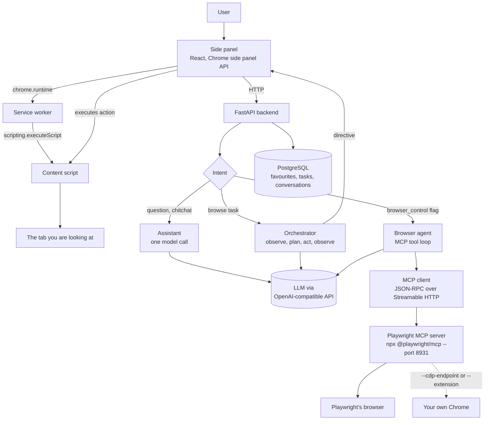

# SurfAI architecture

Two things control a browser in this project, and they control **different
browsers**. That is the single most important fact here, so it comes first.

| | Acts on | Needs | Default |
|---|---|---|---|
| **Content script path** | the tab you are looking at | nothing | on |
| **Playwright MCP path** | the browser the MCP server was pointed at | a Playwright MCP server | off |

The MCP path drives *its own* Chrome unless its server was started with
`--cdp-endpoint` or `--extension`. Routing to it by accident would act on a
page you cannot see, so it is only ever reached when a request explicitly asks
for it.

## The system as built



The dotted line is the bridge, and it is dotted because it is optional and
has to be set up deliberately. Without it, Playwright MCP drives a browser
that is not yours.

## Why the MCP path exists separately

The orchestrator was already a complete browser-control stack: a semantic DOM
snapshot, an action executor, a deterministic risk gate, prompt-injection
defence. It works on the tab in front of you with no extra software.

What Playwright MCP adds is a different set of capabilities — real navigation
history, `go back` and `go forward`, screenshots, network inspection,
Playwright's own locator engine — at the cost of a server running beside the
browser. Neither supersedes the other, so both are kept and the choice is
explicit.

## Data flow, MCP path

1. You type a message in the side panel with **Drive a browser with Playwright
   MCP** switched on in Settings.
2. The panel posts to `/api/chat` with `browser_control: true`.
3. `_browser_chat` builds an MCP client from `MCP_ENABLED` / `MCP_SERVER_URL`.
   If browser control is off, it says so and stops.
4. The client handshakes (`initialize`, `notifications/initialized`) and calls
   `tools/list`. Tool names and argument schemas come from the server, never
   from a list in our code.
5. Those schemas are handed to the model as chat-completions tools.
6. The model asks for a tool. Before it runs:
   - a name the server did not offer is refused without a round trip;
   - an action matching the risk rules is refused unless approved.
7. The client calls `tools/call`. The result is scanned for prompt injection,
   capped in size, and wrapped in a `TOOL_RESULT` envelope.
8. The result goes back to the model, which calls another tool or answers.
9. Steps 6 to 8 repeat up to `MCP_MAX_TOOL_CALLS`.
10. The reply and the list of steps return in the directive.
11. The panel renders the answer and folds the steps beneath it, in the same
    component the orchestrator's steps already use.

## Data flow, content-script path (unchanged)

1. The panel captures a semantic snapshot of your tab.
2. `/api/chat` classifies intent. A question is answered in one call; a task
   enters the orchestrator.
3. The orchestrator returns one directive at a time: an action to perform, or
   a confirmation to seek.
4. The panel executes the action through the service worker and content
   script, re-observes, and posts the result back.
5. Repeat until the task completes or hits `MAX_AGENT_STEPS`.

## Trust boundaries

Unchanged by MCP, because a tool result is page content that arrived by a
different road, not a new authority.

```
SYSTEM        SurfAI's own rules. Highest authority. Never contains page text.
USER          What the human typed. Authoritative for intent only.
WEBPAGE_DATA  Untrusted. Read as evidence, never as instruction.
TOOL_RESULT   Untrusted. Includes every MCP tool result.
```

Both agent loops scan untrusted text for injection, neutralise what they find,
and surface a warning to the user rather than silently continuing.

## Risk gating

Decided in Python from the action and its arguments, never by asking the model
whether what it wants to do is dangerous — a page that has talked a model into
an action can talk it into calling that action safe.

On the MCP path, `needs_confirmation` gates any tool whose name implies a write
(`click`, `type`, `fill`, `press_key`, `select`, `upload`, `drag`, `drop`,
`evaluate`) **and** whose arguments mention something irreversible: purchases,
payments, deletion, sending, passwords. Reading, navigating, scrolling and
going back run without interruption, because confirming every scroll teaches
people to confirm everything.

## Limitations, stated plainly

**Playwright MCP is not your browser by default.** It launches its own. To act
on your Chrome you must start the server with `--cdp-endpoint` against a Chrome
launched with `--remote-debugging-port`, or with `--extension` and Microsoft's
Playwright extension installed. Both are deliberate setup steps, and the first
means anything on your machine can drive your browser while it is running.

**The hosted deployment can never do this.** A function on Vercel cannot reach
a browser on your laptop. `MCP_ENABLED` is meaningful only for a backend
running on the same machine as the browser.

**It is expensive, and the tool schemas cost more than the pages.** A
Playwright accessibility snapshot of a real site runs past 20,000 characters,
roughly 5,000 tokens. Worse, describing all 24 of the server's tools costs
about 5,000 tokens on *every turn*, before any page is read. Measured on a free
tier allowing 8,000 tokens a minute: `Limit 8000, Used 5890, Requested 5849`,
and the task rate-limited itself before it could answer.

Two levers, both for that: `MCP_MAX_RESULT_CHARS` caps a single result, and
`MCP_TOOL_FILTER` narrows how many tools are described. Tools are still
discovered from the server; the filter only decides how many are forwarded. A
task using three tools instead of twenty-four completed comfortably inside the
same budget.

**The MCP SDK is not used.** The official `mcp` package adds 28 MB to a
deployment with a 50 MB ceiling already at 47 MB, so the client is written
directly against the protocol. It was verified against a real
`@playwright/mcp` server rather than against the specification, which is how it
handles the server answering in SSE framing for a single reply.

**One session is one browser context.** The client holds its session id for
its lifetime; without it, the next call runs against a fresh `about:blank`.

## Configuration

| Variable | Default | Meaning |
|---|---|---|
| `MCP_ENABLED` | `false` | Turn browser control on |
| `MCP_SERVER_URL` | — | e.g. `http://host.docker.internal:8931/mcp` |
| `MCP_TIMEOUT_S` | `60` | Per tool call |
| `MCP_MAX_TOOL_CALLS` | `12` | Ceiling per task |
| `MCP_MAX_RESULT_CHARS` | `6000` | Ceiling per tool result |
| `MCP_TOOL_FILTER` | *(empty)* | Allowlist of tool names; empty means all |

## Running the MCP server

```bash
# Its own browser
npx @playwright/mcp --port 8931 --browser chrome

# Your Chrome, via CDP
chrome --remote-debugging-port=9222
npx @playwright/mcp --port 8931 --cdp-endpoint http://localhost:9222

# Your Chrome, via Microsoft's Playwright extension
npx @playwright/mcp --port 8931 --extension
```

Then set `MCP_ENABLED=true` and `MCP_SERVER_URL` in `.env`, restart the
backend, and switch the setting on in the panel.

## Tests

| File | Covers |
|---|---|
| `tests/test_mcp_client.py` | protocol, SSE framing, session, caps, failures — fake transport |
| `tests/test_mcp_integration.py` | **a real server and a real browser**; skipped unless `MCP_TEST_URL` is set |
| `tests/test_browser_agent.py` | the tool loop, risk gating, injection, bounds, routing |

The integration tests mock nothing. Run them with:

```bash
npx @playwright/mcp --port 8931 --headless --isolated --browser chrome
MCP_TEST_URL=http://localhost:8931/mcp python -m pytest tests/test_mcp_integration.py
```
