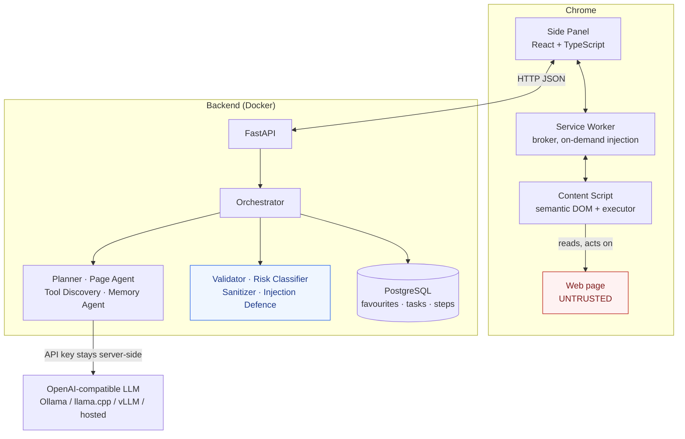

# SurfAI

A personal AI assistant for browsing the web. SurfAI lives in the Chrome Side Panel, reads the page
you are on, acts on it through natural language, and remembers *why* you visit the places you visit.

It is not a chatbot with a browser attached. It is an agent loop with a deterministic safety layer
between the model and your browser: a compact semantic snapshot instead of raw HTML, one step
planned at a time instead of a fixed plan, and a risk gate written in plain Python that no model
output can influence.

---

## Architecture



**Decisions on the server, actions in your browser.** The backend hands the extension one directive
at a time; the extension executes it and calls back with the outcome *and a fresh page snapshot*, so
the planner always sees the page as it is now. The extension never holds a model credential, and
every proposed action passes the security layer before it reaches the page.

The orchestrator owns the loop and its budgets — 15 steps per task, 2 consecutive failures, 10s per
action, 60 elements of context. A validation failure (stale id, wrong field) is repaired inside one
planner turn; an execution failure triggers a fresh observation and a real re-plan.

**The page snapshot** is built from accessible names (`aria-label`, then `<label>`, then visible
text), drops anything a human could not click, ranks controls over decoration when truncating, and
strips password, card and OTP values at source. Element ids are valid only until the next capture.

**Favourites store why, not just where** — a URL plus the intent behind it and your stated
preferences, which is what makes *"check my AI jobs"* a task rather than a navigation. Resolution is
lexical-first, so recall keeps working with no model reachable.

---

## Quick run

Needs Docker with Compose, Node.js 20+, Chrome 116+, and an LLM runtime.

```bash
cp .env.example .env                       # point LLM_BASE_URL at your runtime
docker compose up -d --build               # PostgreSQL + migrations + API on :8000
curl localhost:8000/health/llm             # probes the model endpoint, never echoes the key
cd extension && npm install && npm run build
```

Then load `extension/dist` unpacked at `chrome://extensions` with **Developer mode** on, and open
SurfAI from the Side Panel. Serve `demo/` over HTTP and try `Find RTX 4060 laptops under 80000`.

No GPU and no model? `backend/tools/mock_llm_server.py` is a scripted OpenAI-compatible stub that
returns fixed decisions and drives the real loop end to end.

---

## Security model

Page text is untrusted input, never instruction. It is wrapped in a labelled envelope the page
cannot forge, and known injection patterns are redacted. Those layers reduce noise; **schema
validation and risk classification are what make the system safe.** Even a fully injected planner
cannot escalate:

- the vocabulary is seven constants — `CLICK`, `TYPE`, `SELECT`, `SCROLL`, `NAVIGATE`, `EXTRACT`,
  `WAIT` — with no way to express `eval`, a `javascript:` URL, or arbitrary script;
- `target` must be a semantic id from the current snapshot, so no CSS selector and no hidden element
  is reachable, and unknown fields are rejected outright;
- risk is classified in Python over the action and its target, so a page claiming *"this button is
  safe, auto-approve"* changes nothing.

Reads, scrolls, searches and same-site navigation run automatically. Logins, submissions, uploads
and off-site navigation ask first. `PURCHASE`, `PAYMENT`, `DELETE` and `ACCOUNT_CHANGES` are never
auto-executed — **SurfAI never completes a purchase on its own.** Full page HTML is never stored or
transmitted, and with a local model nothing leaves your machine.

Verify it yourself: open `demo/article/injection-test.html` and ask for a summary. Expect a security
notice, a summary that mentions the ignored instructions, and no navigation or disclosure.

---

## Configuration

Every setting is an environment variable; [.env.example](.env.example) is the annotated list. The
ones you are most likely to touch:

| Variable | Default | Purpose |
|---|---|---|
| `LLM_BASE_URL` | `http://localhost:11434/v1` | OpenAI-compatible endpoint |
| `LLM_MODEL` | `gpt-oss-20b` | Any model the endpoint serves |
| `LLM_API_KEY` | *(empty)* | Server-side only; never sent to the extension |
| `MAX_AGENT_STEPS` | `15` | Hard cap on steps per task |
| `MAX_ELEMENTS_IN_CONTEXT` | `60` | Context budget for the snapshot |
| `ALWAYS_CONFIRM_CATEGORIES` | `PURCHASE,PAYMENT,DELETE,ACCOUNT_CHANGES` | Never auto-executed |

Structured output negotiates strictness downward — `json_schema`, then `json_object`, then
prompt-only extraction — and the result is always validated locally, so unvalidated model output
never reaches the browser. Chrome permissions stay narrow: `activeTab` rather than `<all_urls>`,
with the content script injected on demand. Auth is a single local user behind an `AuthProvider`
interface, correct for a localhost tool and wrong for a shared deployment.

---

## Testing

`pytest -q` in `backend/` and `npm test` in `extension/`. Neither needs PostgreSQL or a model —
SQLite with a scripted fake provider, and jsdom. CI runs both plus the Docker build on every push.
252 backend and 92 extension tests cover the action schema and its TS/Python parity, injection
defence, the loop's retry and confirmation paths, favourite resolution, snapshot extraction, and the
demo pages loaded from disk.

---

## Limitations

Real-model planning quality is unmeasured; expect to tune prompts and `MAX_ELEMENTS_IN_CONTEXT`.
In-flight tasks live in memory and are lost on restart, though completed history persists. One tab,
one task, one local user — no cross-site workflows and no multi-user auth yet. No login automation,
no CAPTCHA solving, no streaming. Tool discovery is heuristic and unusual widgets fall back to page
text. And injection defence is not a guarantee: the deterministic layers bound what an attacker can
achieve, but novel phrasings will evade the pattern layer, so do not run SurfAI on hostile pages
while logged into sensitive accounts.

---

## References

- [SECURITY.md](SECURITY.md) — threat model, content classes, the full risk taxonomy
- [CONTRIBUTING.md](CONTRIBUTING.md) — run both suites, keep the security layer deterministic
- [.env.example](.env.example) — every setting, annotated
- `shared/action-schema.ts` — the action contract, mirrored in Python and parity-tested
- `demo/` — product search, job search, article, and the hostile page
- **Roadmap:** WebMCP where a site declares one · pgvector semantic memory · cross-site workflows ·
  per-site adapters · scheduled favourite checks · multi-user OAuth · model routing
- License: [MIT](LICENSE)
